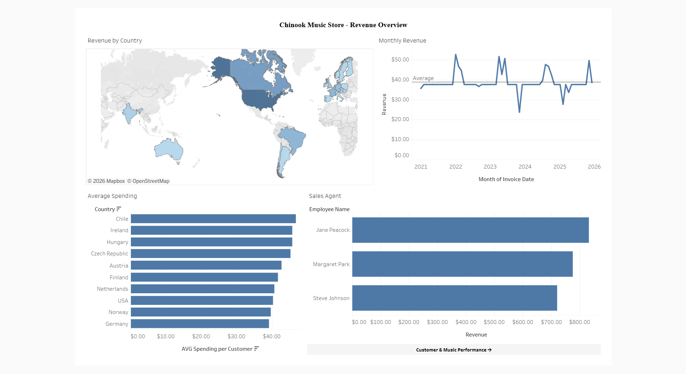
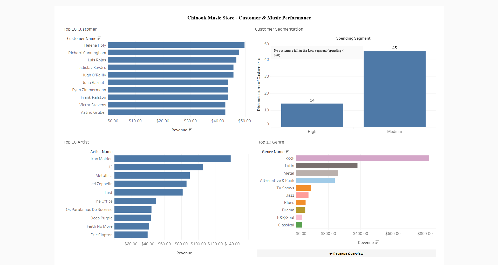

# Chinook Music Store - Revenue & Sales Analysis

An interactive tableau dashboard exploring revenue trends, customer behavior, and music genre performance of the chinook digital music store.

> For dataset details, see the [Chinook SQL Analysis](https://github.com/SitiSuharyanti/Chinook-SQL-Analysis) repository.

---

## Project Overview

This project visualizes the **Chinook Database** (a sample dataset simulating a digital music store) across two dashboards to answer key business questions:

**Dashboard 1 - Revenue Overview**

- Which countries generate the most revenue?
- How has monthly revenue trended over time?
- Which countries have the highest average spending per customer?
- Which sales agent contributes the most revenue?

**Dashboard 2 - Customer & Music Performance**

- Who are the top 10 highest-spending customers?
- How are customers segmented by spending level?
- Which artists generate the most revenue?
- Which music genres are the most popular by revenue?

🔗 **[View Live Dashboard on Tableau Public](https://public.tableau.com/app/profile/siti.suharyanti/viz/ChinookMusicStore/RevenueOverview)**

---

## Dashboard Preview

|                 Revenue Overview                 |                      Customer & Music Performance                      |
| :----------------------------------------------: | :--------------------------------------------------------------------: |
|  |  |

---

## Key Insights

**Revenue Overview**

- The **USA** is the dominant market by total revenue, with strong contributions from Canada, Brazil, and several European countries
- Monthly revenue fluctuates around an **average of $38.81**
- **Chile, Ireland, and Hungary** lead in average spending per customer
- **Jane Peacock** is the top-performing sales agent, followed closely by Margaret Park and Steve Johnson

**Customer & Music Performance**

- **Helena Holý** is the highest spending customer
- **No customers fall in the low spending segment** (<$20), 45 are medium and 14 are high spenders
- **Iron Maiden** is the best selling artist by a significant margin, followed by U2 and metallica
- **Rock** overwhelmingly dominates genre revenue, with latin and metal as distant second and third
